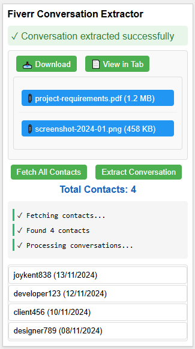

# Fiverr Conversation Extractor &nbsp;&nbsp; [](https://www.buymeacoffee.com/theteam)

A powerful Chrome extension that extracts and manages Fiverr inbox conversations with modern UI, comprehensive dashboard, and advanced file preview capabilities. Features dual-mode interface (popup + dashboard), batch contact fetching, conversation downloading in multiple formats, and intelligent file preview system.


## ✨ Key Features

### 🎨 **Dual Interface Modes**
- 📱 **Popup Mode**: Quick access for simple tasks
- 📊 **Dashboard Mode**: Full-page interface for comprehensive management
- ⚙️ **Easy Switching**: Toggle between modes in settings

### 💬 **Conversation Management**
- 💬 Extract complete chat histories from Fiverr inbox
- 📥 Download conversations in clean Markdown and JSON formats
- 📱 View conversations in a dedicated tab interface
- 📎 Download all conversation attachments
- 📚 Track and organize conversation history
- 💌 Support for message replies and threading
- ⚡ Fast contact fetching with progress indicators

### 🔍 **Advanced File Preview System**
- 🖼️ **Image Preview**: JPG, PNG, GIF, BMP, WebP, SVG support
- 📄 **PDF Viewer**: Built-in PDF viewing capabilities
- 🎯 **3D Model Viewer**: GLB/GLTF model preview with controls
- 📝 **Text Files**: TXT, MD, JSON, XML, CSV, LOG with syntax highlighting
- 🎵 **Audio Player**: MP3, WAV, OGG, M4A, AAC playback
- 🎥 **Video Player**: MP4, AVI, MOV, WMV, FLV, WebM support
- 📦 **Archive Recognition**: ZIP, RAR, 7Z, TAR, GZ file detection

### 📊 **Dashboard Features**
- 📈 **Statistics Overview**: Contact, message, and attachment counts
- 👥 **Contact Grid**: Visual contact cards with hover effects
- 💬 **Conversation Analytics**: Message count, duration, file size metrics
- 📎 **Attachment Browser**: Browse all attachments across conversations
- 🔄 **Real-time Updates**: Live progress indicators and status updates

## Why Use This Extension?

- 🔒 **Secure Backup**: Keep your important client conversations safe and accessible
- 📊 **Better Organization**: Easily manage and search through past communications
- ⏱️ **Time Saver**: Quick export of conversations
- 📱 **Accessibility**: Access your conversations offline and across devices
- 🎯 **Freelancer Focused**: Specifically designed for Fiverr freelancers' needs

## 🎨 Modern UI Features

- 🌈 **Modern Design**: Gradient backgrounds, smooth animations, and professional styling
- 📱 **Responsive Layout**: Optimized for all screen sizes and devices
- ⚡ **Interactive Elements**: Hover effects, smooth transitions, and visual feedback
- 🎯 **Accessibility**: Focus states, keyboard navigation, and high contrast support
- 🔄 **Loading States**: Animated spinners, progress bars, and status indicators
- 🎨 **Customizable Settings**: Date format preferences and display mode selection

## 🔧 Advanced Features

- 🔍 **Smart Search**: Find conversations by keyword, date, or client
- 📋 **Rich Text Support**: Preserves formatting, links, and emoji
- 🔄 **Real-time Updates**: Live progress tracking and status updates
- 📊 **Analytics Dashboard**: Comprehensive statistics and conversation metrics
- 🎨 **Custom Formatting**: Multiple date formats and export options
- 📁 **Organized Downloads**: Automatic folder structure for easy file management

## Download Organization

When you download any file from the extension:

- It will automatically create a folder with the contact's username.
- Attachments will be stored in an `attachments` subfolder.
- Conversation files (both markdown and JSON) will be stored in a `conversations` subfolder.
- All folders will be created automatically by Chrome if they don't exist.

The files will be organized like this:

```
[Downloads Directory]
└── [username]
    ├── attachments
    │   └── [attachment files]
    └── conversations
        ├── fiverr_conversation_[username]_[date].md
        └── [username]_conversation.json
```

This structure keeps all files related to a specific contact organized in their own directory, making it easier to manage multiple conversations and their associated files.

## Use Cases

- 💼 **Portfolio Building**: Extract successful project discussions
- 📝 **Documentation**: Keep records of project requirements
- ⚖️ **Dispute Resolution**: Maintain evidence of agreements
- 📈 **Business Analysis**: Track communication patterns
- 🎓 **Learning**: Review past successful interactions

## Keywords
`fiverr-chat-export` `fiverr-message-backup` `Fiverr-inbox-manager` `Fiverr productivity tool` `conversation-extractor` `chat-history-tool` `fiverr-inbox-manager` `freelancer-tools` `client-communication-backup` `message-archiver` `chat-downloader` `fiverr-extension`

## Installation

1. Clone this repository or download the ZIP file
2. Open Chrome and go to `chrome://extensions/`
3. Enable "Developer mode" in the top right
4. Click "Load unpacked" and select the extension directory

## 🚀 Usage

### **Popup Mode (Quick Access)**
1. Open your Fiverr inbox
2. Click the extension icon in your browser toolbar
3. Choose your action:
   - Click "📞 Fetch All Contacts" to see all your conversations
   - Click "💬 Extract Conversation" when viewing a specific conversation
   - Click "📊 Open Dashboard" for full-page interface
4. Use download/view buttons to save or preview conversations
5. Click attachment preview/download buttons for files

### **Dashboard Mode (Comprehensive Management)**
1. Click "📊 Open Dashboard" from popup or access directly
2. Navigate between tabs:
   - **📊 Overview**: See statistics and quick actions
   - **👥 Contacts**: Manage all contacts in visual grid
   - **💬 Conversations**: View and export conversation data
   - **📎 Attachments**: Browse and preview all attachments
3. Use contact cards to extract conversations
4. Preview files before downloading
5. Export conversations in multiple formats

### **File Preview Features**
- Click "👁️ Preview" on any attachment to view it inline
- Supported formats: Images, PDFs, 3D models, text files, audio, video
- Download files directly from preview modal
- Archive files show helpful information about contents

## Preview

Here's how the extension looks:



Example contact format:
```
joykent838 (13/11/2024)
```

For the complete extension UI mockup, see [Extension UI Design](docs/final-popup-mockup.html)

## Permissions

- `activeTab`: To interact with Fiverr tabs
- `storage`: To store conversation data
- `scripting`: To inject content scripts
- `downloads`: To save conversations and attachments
- `tabs`: To open conversations in new tabs

## Technical Details

### Supported Features
- Message threading and reply chains
- Attachment handling (images, documents, etc.)
- Markdown conversion
- HTML export options
- JSON data format
- Error handling and retry mechanisms

### Performance
- Lightweight (<2MB memory usage)
- Fast contact fetching
- Efficient storage management
- Minimal CPU usage
- Quick search capabilities

## Future Updates

- 📱 Mobile version support
- 🌐 Multi-language support
- 📊 Advanced analytics dashboard
- 🔄 Real-time sync capabilities
- 🤖 AI-powered conversation insights
- 📦 Bulk export features (coming soon)

## Development

The extension uses:
- Manifest V3
- Chrome Extension APIs
- Modern JavaScript (ES6+)
- Markdown for conversation export

## Support My Work

<div align="center">
  
  [](https://www.buymeacoffee.com/theteam)
  
  <p>If you find this project helpful, consider buying me a coffee! ☕️</p>
  
  <a href="https://www.buymeacoffee.com/theteam">
    
  </a>
</div>

## License

MIT License
